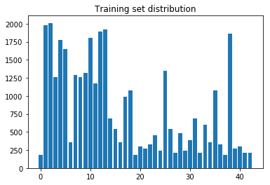

# Traffic Sign Recognition


## 1. Reflection

##### Basic Summary of the data set

I used ```.size``` on the y components of the data sets to extract numbers.
To find the number of unique labels, I important numpy and called ```np.unique()``` on the ```train['lables']``` and took the ```.size``` of the resulting list.

- Number of training examples = 34799
- Number of testing examples = 12630
- Image data shape = (32, 32, 3)
- Number of classes = 43

##### Exploratory visualization
I pulled this straight from the _CarND-LeNet-Lab_. I don't understand why ```cmap``` paramenter didn't make a difference, but maybe that only works for 1-D data, not 3-D? matplotlib is a mysterious creature, variegated and occlusive.

I also generated a histogram by zeroing an array and counting up the occurrance of each sign type. It looks like the train, validation, and test sets are of roughly similar distribution, but there is a wide variety between sign types.



##### Preprocessing

I copied over the LeNet preprocessing script, adjusting for the change in image depth and number of classes.

This initial approach seemed to hit a plateau, and I modified preprocessing to move from 3 channel color to grayscale. I also normalized by dividing by 255.0 and subtracting 0.5.

However, this grayscale model, while better, was hovering at 92% after 200 epochs, and I decided to move back to the original color model, but this time with proper normalization in place. This made this difference, and the final model required only 40 epochs to reach the desired precision.


##### Model

Nothing fancy here. I pulled over the LeNet model with the parameter alterations suggested in the classroom videos. I also added extra connections in the last layer of the network to account for the additional variety in classes.

My model consists of the following layers:

| Layer | Description |
|:-:|:-:|
| Input| 32x32x3 RGB image |
| Convolution 5x5 | 1x1 stride, valid padding, outputs 28x28x16 	|
| RELU	|												|
| Max pooling	| 2x2 stride,  outputs 14x14x16 |
| Convolution 5x5	    | 1x1 stride, valid padding, outputs 10x10x26 |
| RELU	|												|
| Max pooling	| 2x2 stride,  outputs 5x5x26 |
|Flatten | outputs 650x1 |
| Fully connected		| outputs 200x1 |
|Dropout | adjustable, .55 train, 1.0 test|
| Fully connected		| outputs 84x1 |
| RELU	|												|
| Fully connected		| outputs 43x1 |
| Softmax				| outputs 43 classes |

##### Train, Validate, and Test

Testing was painful. After abandoning a 3-color pipeline for a simpler grayscale, I still ran something like 40 epochs with learning rates of 0.001, narrowing to 0.0003 and 0.0001 in the last couple. And gradually, the learning rate started alternately approaching my 93% target. I cut short training at epoch 40 when it looked like a local validation max may have been reached, to avoid overtraining.

- validation set accuracy of 94.7%
- test set accuracy of 94.1%

_//  new: _

Thoughts on my approach to finding a solution? I followed the ****ing directons, that what I did. Why LeNet? Because it's a basic recognition network that if it works fine for little pictures digits probaby does the same thing for little picures of signs. I added a few extra convolutions just in case, and threw in a dropout layer to make the logits more robust. I did not sign up for this class to learn how to be more effusive and verbose in my writeups, and I resent being told to fix a different set of things the second time around.

_//_


## 2. Test a Model on New Images

##### Five signs I tried:

[1stop]: ./more_signs/14.jpg
[2yield]: ./more_signs/13.jpg
[3exc]: ./more_signs/18.jpg
[4kr]: ./more_signs/38.jpg
[5-30k]: ./more_signs/1.jpg
[6menatwork]: ./more_signs/25.jpg

These signs are all clear and in full brightness, but some of their corners are chopped off, which shouldn't have much effect because I am using ```'valid'``` padding. However, several of the images do have a stock photo watermark (hard to see after I scaled them to 32x32, but the original png's show it clearly). This might count as a partial occlusion. I also had difficulty with a 6th Men at Work sign, which looks like a lot of other traingle caution signs and when my model was at 86%, it was the only sign I got wrong.

Here are the results of the prediction:


| Image | Class |     Prediction	|
|:---------------------:|:---------------------------------------------:|:-:|
|![Stop][1stop] | Stop  | Stop |
|![yield][2yield]| Yield | Yield |
|![exclamation][3exc]| General Caution| General caution |
|![right][4kr]| Keep right | Keep right |
|![30kph][5-30k]| Speed limit (30km/h)| Speed limit 30kph |
|![menatwork][6menatwork]|Road work| Road work |

My model scored extremely well on my test images. They were of high quality and good color balance, so this may be expected, but I am still proud that I got 100% on these five. This compares with a 94% accuracy on the test set, and a 95% accuracy on the validation set. In order to improve these numbers, I would need significantly more data, and likely more balanced data between the classes. I could also augment with occluded or transformed samples to make the classification more rigorous.


_// new: _

Certainties: Yeah, you got me. I top-k'd the logits instead of the softmax of the logits. If you bothered to check the python notebook, I already ammended my solution there, I just didn't bring the probabilities over to the fancy chart in my writeup because the qualitative results were the same and cross referencing the numbers is a pain in the ass. Here's the raw output. Sort it out yourself.

TopKV2(values=array([[  9.99999762e-01,   1.92025908e-07,   5.33240230e-10,
          2.53092044e-11,   7.42075932e-12],
       [  1.00000000e+00,   5.46252174e-22,   6.69082040e-25,
          1.15080208e-26,   4.84880867e-27],
       [  1.00000000e+00,   2.97114083e-10,   2.58228979e-16,
          1.08288720e-17,   1.47168388e-20],
       [  1.00000000e+00,   3.72839626e-09,   2.60810769e-13,
          1.09090339e-14,   7.76291455e-16],
       [  9.99946475e-01,   5.34658247e-05,   1.43672563e-13,
          1.50983318e-14,   9.77618238e-15],
       [  9.99860406e-01,   1.38314688e-04,   1.31873105e-06,
          1.54268811e-08,   4.51725635e-09]], dtype=float32), indices=array([[14,  1, 25,  5, 17],
       [13,  9, 35, 28, 15],
       [18, 27, 24, 26,  4],
       [38, 34, 36, 40, 20],
       [ 1,  2,  0,  5, 40],
       [25, 29, 31, 30, 24]], dtype=int32))

_//_

My model was extremely certain about most of its classifications, and I acheived 100% recognition. However, the trickiest sign for my model (and probably for any model) was the 30kph speed limit sign, which at low resolution is easy to mistake for any other speed sign. Due to the shape of the 3, it came close to reading as a 5, a 2, or an 8, and the whole shape also registered vaguely circular, which suggested a low probability match with a roundabout sign.

## 3. Possible Improvements

I could go back and add more data, convolute some of the data provided, add more dropout layers, and round out the class examples so the classifier has more balanced input.
